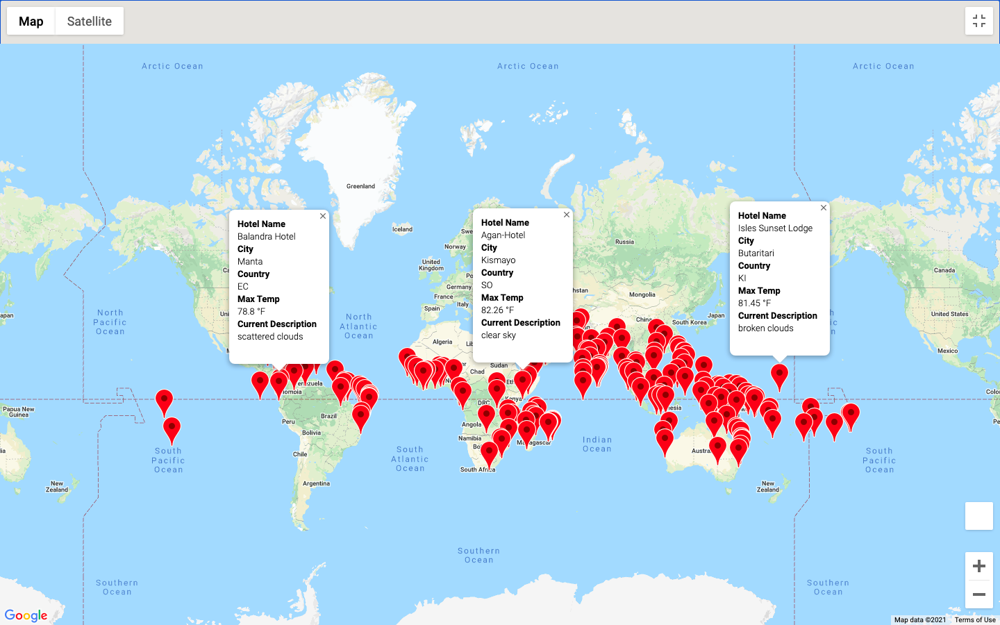
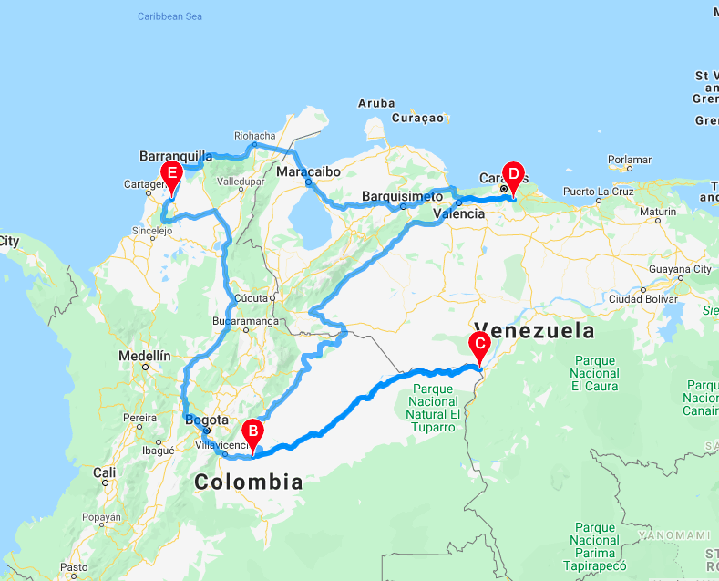
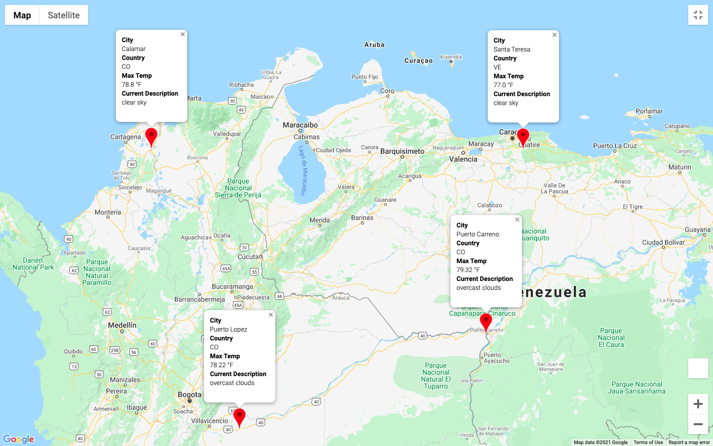

# World_Weather_Analysis

### Purpose 
The purpose of this World Weather Analysis project is to provide the user with travel destinations based on their ideal minimum and maximum temperatures. The PlanMyTrip App will filter through data from around the world based on the user's weather preferences and provide potential travel destinations and nearby hotels along with the maximum temperature and current weather description. 

## Deliverable 1: Weather Database
In the first section, we generated a set of 2000 random latitudes and longitudes. We then performed an API call with the OpenWeatherMap to retrieve various cities across the world and their coordinates. A dataframe was created to show each city, it's country, latitude, longitude, max temperature, humidity, cloudiness, wind speed and weather description (as shown below). 

[Weather Database](Weather_Database/WeatherPy_Database.csv)

## Deliverable 2: Vacation Search 
In the second section, the user is prompted to enter their ideal minimum and maximum temperatures for their trip. Based on the user's response, a dataframe was created to show the cities that fit within the range. Using google directions API, JSON data was retrieved to show the name of a hotel in each city. A marker layer map was then created to show the various cities that fit the temperature preferences. The pop-up markers provide information on the hotel name, max temperature and weather description (as shown below)

## Deliverable 3: Vacation Itinerary 
In the third section, we used Google Directions API to create a travel itinerary between 4 cities. In this particular project I chose Calamar, Puerto Lopez, Puerto Carreno and Santa Teresa. A direction layer map was created to show the route which starts at Calamar (shown below). 

Finally, a marker layer map was created to specifically show information of the 4 cities on the travel route. The pop-up markers provide information on the hotel name, city, country, max temperature and weather description (as show below).

